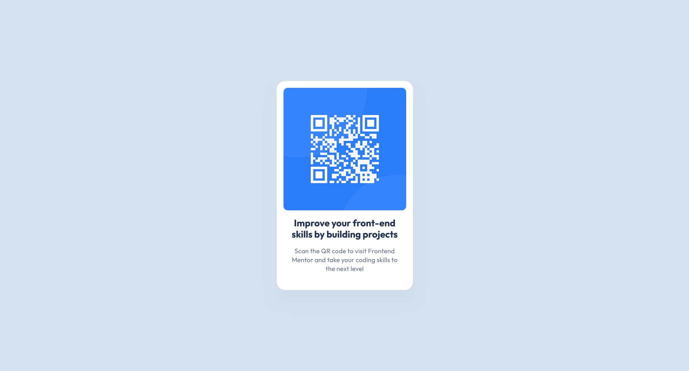

# Frontend Mentor - QR code component solution

This is a solution to the [QR code component challenge on Frontend Mentor](https://www.frontendmentor.io/challenges/qr-code-component-iux_sIO_H).

## Table of contents

- [Frontend Mentor - QR code component solution](#frontend-mentor---qr-code-component-solution)
  - [Table of contents](#table-of-contents)
  - [Overview](#overview)
    - [Screenshot](#screenshot)
  - [Links](#links)
  - [What have I learned](#what-have-i-learned)
  - [Built with](#built-with)
  - [Contact](#contact)

## Overview

### Screenshot

## Links

- [Solution](https://www.frontendmentor.io/solutions/qr-code-component-JrT7QuYXMG)
- [Live Site](https://marcin-m-frontend-mentor-qr-code-component.vercel.app/)

## What have I learned

Exercise me to practice setting up the development environment, integrating the repository with vercel and creating stylesheets using Sass. With this simple task, I paid attention to the precise implementation of the project based on the mockup made in Figma.

## Built with

- Semantic HTML5 markup
- [SASS preprocessor](https://sass-lang.com/)
- Flexbox
- CSS Grid

## Contact

Coded by [Marcin Mikos](mailto:mikos.marcin.m@gmail.com) - feel free to cotnact me!
